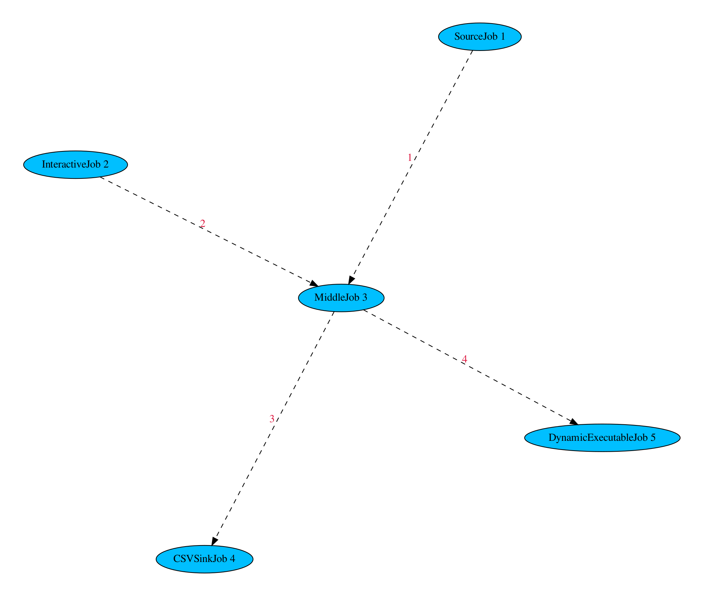
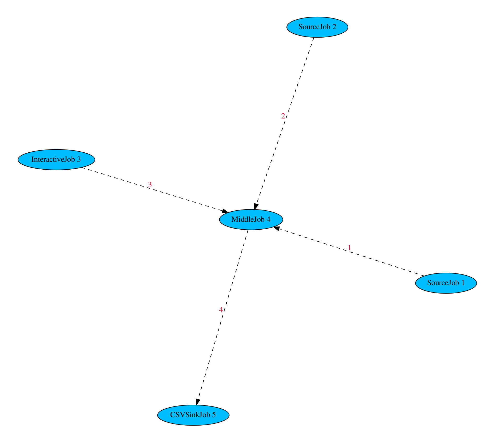
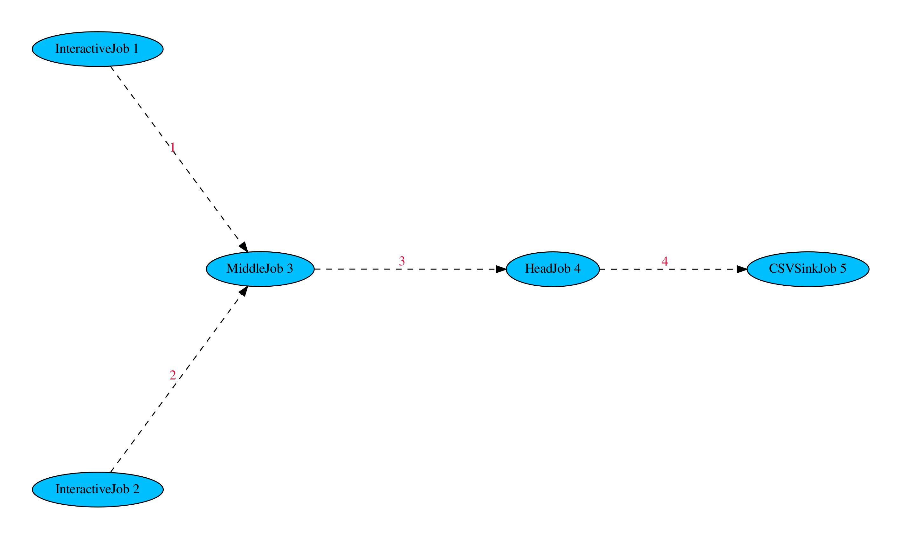

# Simple Examples

To explain the configuration of **MARVELO** we provide four simple examples. You can find them in the examples folder. The Examples are shortly described in the table below.
This page explains only the settings of the examples. If you want to know in more detail, how these examples work, take a look at the page about [How to use MARVELO](usage), where we go through the first example step by step. In the page [Complex Example](complex_examples) we go through the development of a more complex network. 

1. [example_1](#first-example), first configuration
2. [example_2](#second-example), interactive + multiple Inputs/Outputs + ExecutableJob
3. [example_3](#third-example), interactive with default value and Buffer
4. [example_4](#fourth-example), head in Job


## First Example

In the first example we want to show the basic configuration of a simple network in FISSION. The network consists of 3 Jobs. The first Job, named SourceJob, sends and print a number every second, which is always increased by one, to the MiddleJob. After the MiddleJob received the number, it print the number and send it to the CSVSinkJob. The CSVSinkJob from FISSION write the number in a .csv-File. 


In config.py the network is configured. First we need to import all Jobs, Pipes and Nodes, which we use. Under USER we fill in the user on the remote machines. Next we can define the log-level and the name of the log-file. We also have to enter the client IPv4. The Debug Window collect all stdouts and print them on the console. To see the print statements we enable the Debug Window by setting DEBUG_WINDOW = True. Now we have to set the inputs, outputs and other settings for our Jobs. The SourceJob is sending the number via a PicklePipe with the ID 1 to the MiddleJob. So the MiddleJob has as input the PicklePipe with the ID 1. The same way, we configure the Pipe between MiddleJob and CSVSinkJob. The CSVSinkJob needs also a path, where the .csv-File is placed. Under NODES we give all Nodes with the IPv4, which we can use for the network.

In jobs/jobs.py are the SourceJob and the MiddleJob defined. To define a Job in Python we need to inherit from fission.core.jobs.PythonJob. Then every Job is an own class, where we overwrite the run function. We have to return a tuple as output. Multiple outputs are shown in the [Second Example](#second-example). 

Now we can simulate or run the network. For simulation we go to examples directory and execute:
```
python3 manage.py example_1 simulate
```
If we want to run the configuration on our network:
```
python3 manage.py example_1 run
```

## Second Example

The second example is very similar to the first one. We have the SourceJob from the [First Example](#first-example) and an InteractiveJob to the start. With the InteractiveJob we can type in values at run time. A new terminal window will be opened where we can type in new values. The MiddleJob gets his inputs from the SourceJob and InteractiveJob. The inputs of the function are mapped to the inputs, we configured in the config.py file. In this example the PicklePipe(1) is the first and PicklePipe(2) the second input for the MiddleJob. The output-mapping works similar to the input-mapping. The MiddleJob has the return-value: 
```
return tuple([value]*2)
```
The first item of the tuple is mapped to the first output of the MiddleJob in the config.py file. In this example the tuple consists of twice the same item. So the value is mapped to PicklePipe(3) and IntPipe(4). The PicklePipe is the input for the CSVSinkJob, known from the [First Example](#first-example). The IntPipe(4) is the input for a ExecutableJob. The ExecutableJob can be written in a different programming language than Python.
Important for the ExecutableJob is a pipe, so that the Job can process the data. In this example the IntPipe is given. The pack and unpack function must be overwritten, like in the example. 



For simulation we go to examples directory and execute:
```
python3 manage.py example_2 simulate
```
If we want to run the configuration on our network:
```
python3 manage.py example_2 run
```


## Third Example

In the third example we show how to use the InteractiveJob to adjust values at run time, but not to type the values every time. In this example the two SourceJobs are similar to the SourceJob from the [First Example](#first-example). By typing a '+' or a '-' into the InteractiveJob-terminal we can configure the MiddleJob, if it adds or subtracts the values from the SourceJobs. To make this possible we need a new pipe, in this example called InteractivePipe. We have three configuration options: OPTIONAL_DEFAULT, OPTIONAL_STORE, OPTIONAL_BUFFER_SIZE. In OPTIONAL_DEFAULT we can set a default_value for the pipe, in this example the '+'. With OPTIONAL_STORE we can decide if a value once typed is maintained. In the example if we typed a '-' it is maintained and the MiddleJob will subtract until we type in something different. In OPTIONAL_BUFFER_SIZE we can set a buffer size. So for example OPTIONAL_BUFFER_SIZE = 1 and first we type '-' and then '+' before the MiddleJob executes once, the MiddleJob will add. So only the last input will be stored. The rest of the example is similar to the examples shown before. 



For simulation we go to examples directory and execute:
```
python3 manage.py example_3 simulate
```
If we want to run the configuration on our network:
```
python3 manage.py example_3 run
```

## Fourth Example

In the fourth example we show how to use the additional head, which can be used for flags. The head has a length of 8 bit and first three bits are reserved for a corrupted, reset and finish flag. The other 5 bits can be used freely. In the example the MiddleJob adds two values, which are given by both InteractiveJobs. If the value of the sum is greater or equal 10, the MiddleJob set the eighth bit. We can work with the head, if we set the class attribute HEAD true. The HeadJob looks for the eighth bit and change the output for the .csv-file at the end of the CSVSinkJob. 



For simulation we go to examples directory and execute:
```
python3 manage.py example_4 simulate
```
If we want to run the configuration on our network:
```
python3 manage.py example_4 run
```


